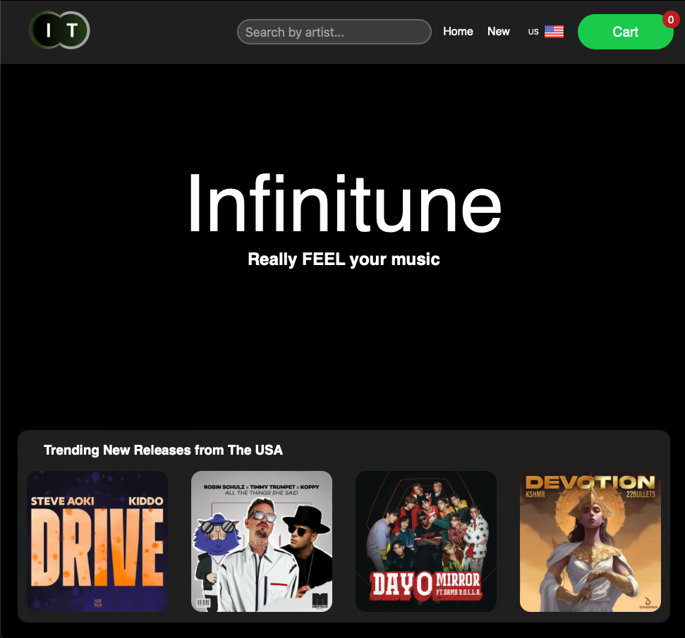
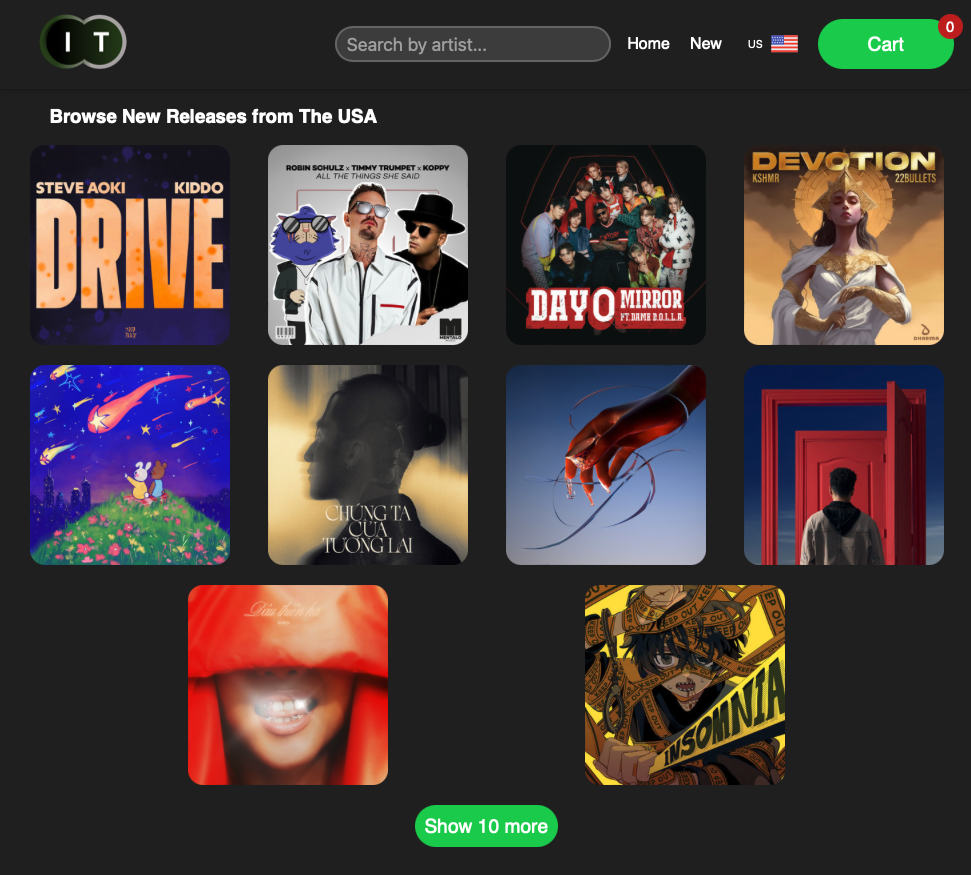
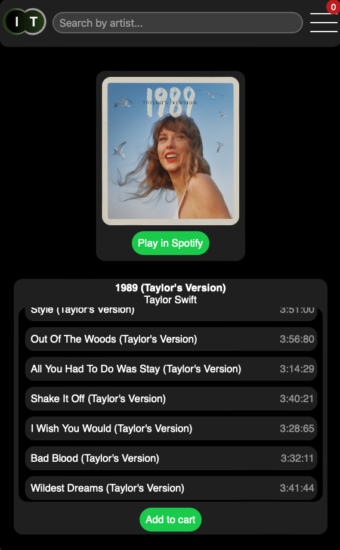
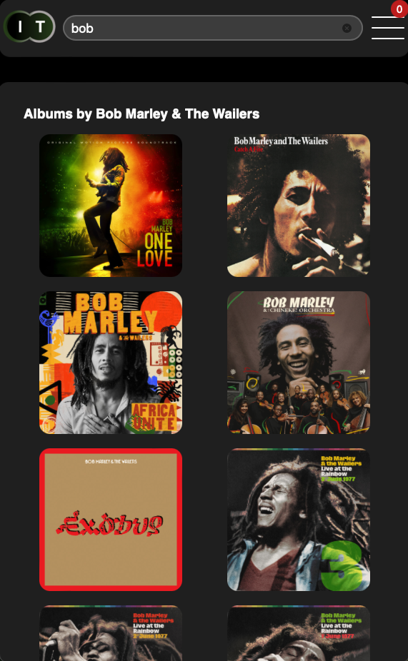

# Infinitue

---

## About this project

This is the shopping cart assigment set by The Odin Project.  The purpose of thsi project was to showcase everthing I have learnt during teh react course, utilizing 3rd party API's links, animation etc.. 
I chose to take inspiration from my favourite app Spotify and design a "shopping cart" for physical CD's. 
Im inpressed with Spotify's API and the flexibility it gave me to but this app. 

---

## Technologies used

-React
 
-JS
 
-CSS

---

## Screenshots

### Picture 1

### Picture 2

### Picture 3

### Picture 4

### Picture 5

